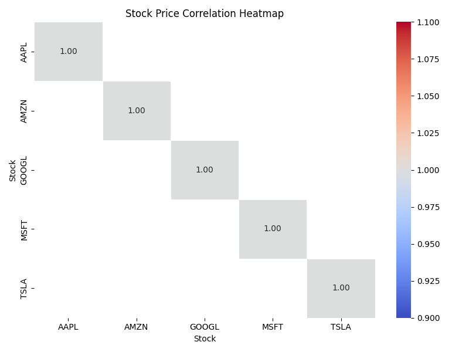

# Stock Market Data Analysis

## Project Overview

This project simulates stock market data, processes it, and performs analysis on stock price trends, volatility, and correlations. It uses Python with libraries like **pandas**, **matplotlib**, and **seaborn** to clean, analyze, and visualize stock data. The project generates dummy stock data, processes it through an ETL pipeline, and produces insightful visualizations to understand stock market behavior.

## Idea Description

The main goal of this project is to analyze stock price data, specifically:
1. **Stock Price Trends**: Visualize how the prices of different stocks evolve over time.
2. **Volatility**: Calculate and plot the rolling standard deviation of stock prices to identify periods of high and low volatility.
3. **Correlations**: Examine how different stocks correlate with each other, helping investors understand relationships between stock performances.

---
## Idea implementaion

### Stock price coorrelation heatmap:


### Stock Price Trends:


### Stock Price Volatility:


---
## Prerequisites

Before running the project, you need to have the following installed:

- **Python** (3.x)
- **pip** (Python package installer)

---

## Libraries Used

The following libraries are used in the project:

- **`pandas`**: For data manipulation and cleaning. We use it for reading, processing, and transforming the stock market data.
- **`numpy`**: To generate random numerical data (e.g., stock prices, volumes).
- **`random`**: To generate random data entries and introduce missing values.
- **`matplotlib`**: For creating static visualizations like line plots for stock trends and volatility.
- **`seaborn`**: For creating aesthetically pleasing heatmaps (used for correlation analysis).

### Installation

To install the required libraries, you can use `pip`:

```bash
pip install -r requirements.txt

```

---

## How to Run the Project

### 1. Clone the Repository (Optional)

If you haven't already, clone the repository to your local machine:

```bash
git clone https://github.com/GitEagleY/Stock_Market_Data_Analysis.git
cd Stock_Market_Data_Analysis
```

### 2. Generate Raw and Processed Data

Run the script `generate_data.py` to generate the raw and processed stock data.

```bash
python src/generate_data.py
```

This will create two CSV files:

- `stock_raw_data.csv`: Contains raw simulated stock market data with some missing values.
- `stock_processed_data.csv`: Contains the cleaned data after missing values are removed.

### 3. Analyze and Visualize Data

Once the data is generated, you can run `analysis.py` to generate visualizations and analyze the data:

```bash
python src/analysis.py
```

This will:
- Plot the stock price trends for each stock over time.
- Display a rolling standard deviation (volatility) plot for each stock.
- Show a correlation heatmap for the stock prices.

---

## Example Use Cases

Here are some examples of what you can do with the project:

1. **Stock Price Trends**:
   - See how the closing price of different stocks (e.g., AAPL, AMZN, TSLA) changes over time.
   - Compare the price movements of different stocks.

2. **Volatility**:
   - Observe periods of high volatility where stock prices fluctuate more (indicating uncertainty or news events).
   - Compare volatility between different stocks.

3. **Correlation Analysis**:
   - Understand how stock prices are related (e.g., are AAPL and MSFT correlated?).
   - Use the correlation heatmap to identify pairs of stocks that tend to move together.

---

## Skills Learned

By completing this project, you will have gained the following skills:

- **Data Cleaning and Processing**: Using `pandas` to handle raw stock data, clean it, and create meaningful columns like daily changes and volatility.
- **Data Visualization**: Using **matplotlib** and **seaborn** to create various types of plots, including line plots and heatmaps.
- **Stock Market Analysis**: Performing basic analysis on stock price trends, volatility, and correlations.
- **Working with Random Data**: Simulating realistic stock market data using random generators and introducing missing values.
- **Correlation Analysis**: Understanding the relationship between different stocks using correlation matrices.

---
